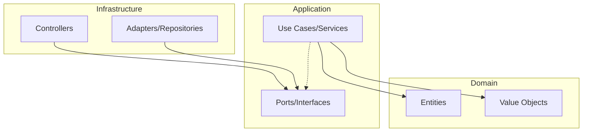

# Career Track API - NestJS Backend

## 🚀 Project Overview

This project is a high-performance backend built with **NestJS** and **TypeScript**, following **Hexagonal Architecture** (Ports and Adapters) principles to ensure scalability, maintainability, and testability.

## 🛠 Tech Stack

- **Framework:** NestJS
- **Language:** TypeScript
- **Documentation:** Swagger (OpenAPI)
- **Testing:** Jest & Supertest
- **Architecture:** Hexagonal (Clean Architecture)

## 🏗 Architecture: Hexagonal (Ports and Adapters)

The project is structured to decouple the business logic from external dependencies (frameworks, databases, APIs).



### Folder Structure

- `src/core/domain`: Contains entities and business rules (Pure TS).
- `src/core/application`: Contains usecases and port definitions (Interfaces).
- `src/infrastructure/adapters`: Implementations of the ports (Database, Externals).
- `src/infrastructure/controllers`: Entry points (NestJS specific).

## 🗺 Roadmap

- [x] Phase 1: Project Setup & Architecture Definition
- [ ] Phase 2: Core Domain Implementation (Entities & Business Rules)
- [ ] Phase 3: Infrastructure Integration (Database & Auth)
- [ ] Phase 4: Feature Implementation (Career Tracks, Lessons, Users)
- [ ] Phase 5: Advanced Testing (Integration & Performance)
- [ ] Phase 6: Deployment & CI/CD Setup

## 🚀 Lanzamiento y Construcción

```bash
# Instalación de dependencias
npm install

# Desarrollo (con hot-reload)
npm run start:dev

# Construcción para producción
npm run build

# Ejecución en producción
npm run start:prod
```

## 📖 API Documentation

Once the server is running, visit:
`http://localhost:3000/api/docs`

## 🧪 Running Tests

```bash
# Unit tests
npm run test

# E2E tests
npm run test:e2e
```
