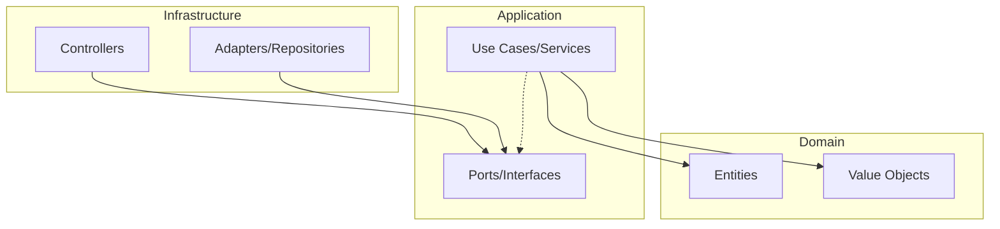

# Career Track API - NestJS Backend

## 🚀 Project Overview

This project is a high-performance backend built with **NestJS** and **TypeScript**, designed for **tracking job applications** and processes. It follows **Hexagonal Architecture** (Ports and Adapters) principles to ensure scalability, maintainability, and testability.

## 🛠 Tech Stack

- **Framework:** NestJS
- **Language:** TypeScript
- **Documentation:** Swagger (OpenAPI)
- **Testing:** Jest & Supertest
- **Architecture:** Hexagonal (Clean Architecture)

## 🏗 Architecture: Hexagonal (Ports and Adapters)

The project is structured to decouple the business logic from external dependencies (frameworks, databases, APIs).


```mermaid
graph TD
    subgraph Infrastructure
        A[Controllers]
        B[Adapters/Repositories]
    end
    subgraph Application
        C[Ports/Interfaces]
        D[Use Cases/Services]
    end
    subgraph Domain
        E[Entities]
        F[Value Objects]
    end

    A --> C
    D --> E
    D --> F
    B --> C
    D -.-> C
```

### Folder Structure

- `src/core/domain`: Contains entities and business rules (Pure TS).
- `src/core/application`: Contains usecases and port definitions (Interfaces).
- `src/infrastructure/adapters`: Implementations of the ports (Database, Externals).
- `src/infrastructure/controllers`: Entry points (NestJS specific).

## 🗺 Roadmap

- [x] Phase 1: Project Setup & Architecture Definition
- [x] Phase 2: Core Domain Implementation (User & Job Application Entities)
- [x] Phase 3: Infrastructure Integration (In-Memory Adapters, JWT Auth)
- [x] Phase 4: Feature Implementation (Job Applications: CRUD - Create, List, Update, Delete)
- [x] Phase 5: Advanced Testing (TDD implementation for all Use Cases)
- [x] Phase 6: Refactoring & Security Hardening
  - [x] Implement `@nestjs/config` for environment variables (`.env`).
  - [x] Add DTO validation with `class-validator` and `class-transformer`.
  - [x] Refine Exception messages and Repository error states.
  - [x] Standardize all imports to relative paths for consistency.
- [/] Phase 7: Database Integration (PostgreSQL + TypeORM)
  - [x] External Infrastructure setup & Dynamic Env loading.
  - [x] Database Schemas (ORM Entities) & Domain Mappers.
  - [x] TypeORM Repository Adapters implementation.
  - [ ] Implement Env Variable Validation (Joi/Zod).
  - [ ] Activate TypeORM Repositories in Modules.
- [ ] Phase 8: Deployment & CI/CD Setup

## 🚀 Lanzamiento y Construcción

```bash
# Instalación de dependencias
npm install

# Desarrollo (con hot-reload)
npm run start:dev

# Construcción para producción
npm run build

# Ejecución en producción
npm run start:prod
```

## 📖 API Documentation

Once the server is running, visit:
`http://localhost:3000/api/docs`

## 🧪 Running Tests

```bash
# Unit tests
npm run test

# E2E tests
npm run test:e2e
```
