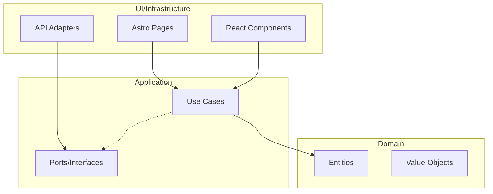

# Career Track Web - Astro Frontend

## 🚀 Overview

This is the frontend of the **Career Track** application, built with **Astro 5** and **React 19**. It follows **Hexagonal Architecture** principles to match the robust design of the backend (NestJS).

## 🏗 Architecture: Hexagonal (Ports and Adapters)

We apply clean architecture to ensure the business logic is decoupled from frameworks and external services.



### Folder Structure

- `src/core/domain/`: Pure TypeScript entities and business rules.
- `src/core/application/`: Port definitions (interfaces) and Use Cases.
- `src/infrastructure/adapters/`: Implementations of ports, like API clients using `fetch`.
- `src/infrastructure/components/`: Reusable UI components (React/Astro).
- `src/pages/`: Astro routing system.

## 🛠 Tech Stack

- **Framework:** [Astro 5](https://astro.build/)
- **UI Library:** [React 19](https://react.dev/)
- **Validation:** [Zod](https://zod.dev/)
- **Language:** TypeScript (Strict mode)
- **Formatting & Linting:** ESLint 9 + Prettier (with Astro plugins)

## 🏃 Getting Started

This package is part of a **pnpm workspace**. To run it individually:

```bash
# From the root directory
pnpm --filter @career-track/web run dev
```

Or from within this directory:

```bash
pnpm dev
```

## 🧪 Best Practices & Standards

### 🖋 Nomenclatura Consolidada

- **Archivos:** `kebab-case.extension` (ej: `login.use-case.ts`).
- **Clases:** `PascalCaseUseCase` (ej: `LoginUseCase`).
- **Componentes:** `PascalCase.tsx`.
- **Mocks/Factories:** `camelCase` (ej: `createJobApplicationMock`).

### 🏛 Principios de Diseño

- **Zero placeholders**: Siempre usa assets reales o generados.
- **Type Safety**: Uso estricto de Zod para validación en tiempo de ejecución.
- **Pareto 20/80**: Foco en testear los Casos de Uso (Application Layer) para asegurar el 80% de la lógica con el 20% del esfuerzo.
- **Component Island Architecture**: React solo donde la interactividad lo requiera.
